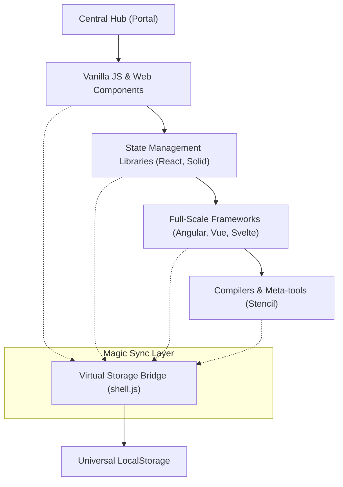

# Technical Specification: JavaScript Frameworks Todo Apps

## Architectural Overview

**JavaScript Frameworks Todo Apps** is a multicentric, comparative architecture designed to systematically benchmark UI implementation patterns across 10 distinct web frameworks. The project serves as a comprehensive study into the **Modern Web Ecosystem**, bridging the gap from minimal reactivity to complex enterprise-level engineering standards.

### Framework Ecosystem Flow

---

## Technical Implementations

### 1. Core Synchronization Engine
-   **Virtual Storage Bridge**: Implements a singleton interceptor (`shell.js`) that patches the native `Storage.prototype` to enable cross-framework data persistence.
-   **State Normalization**: Automatically transforms framework-specific data schemas into a standardized archival format for seamless synchronization.

### 2. Modules & Libraries
-   **Declarative Frameworks**: Utilizes **React**, **Solid**, and **Vue** to demonstrate divergent Virtual DOM and fine-grained reactivity strategies.
-   **Compiled Runtimes**: Deploys **Svelte** and **Stencil** to showcase compile-time optimizations that eliminate runtime overhead for maximum performance.

### 3. Statistical Framework
-   **Analysis Pipelines**: The repository structures formal synchronization workflows including **Schema Mapping**, **Lifecycle Hooks**, and **Storage Proxying**.
-   **Universal Bridge**: Integrates a shared JSON-based persistence layer to ensure high-fidelity state management across disparate framework architectures.

---

## Technical Prerequisites

-   **Runtime**: Node.js 20.x or higher ([Nodejs.org](https://nodejs.org/)).
-   **Package Management**: npm 10+ (included with Node.js).
-   **Deployment**: GitHub Pages environment with Actions-based CI/CD pipeline.

---

*Technical Specification | JavaScript Frameworks | Version 1.0*
