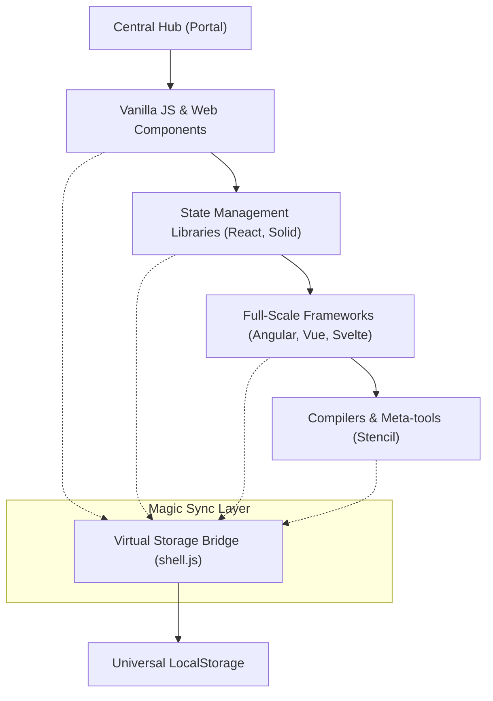

# Technical Specification: JavaScript Frameworks Todo Apps

## Architectural Overview

**JavaScript Frameworks Todo Apps** is a multicentric, comparative architecture designed to systematically benchmark UI implementation patterns across 10 distinct web frameworks. The project serves as a comprehensive study into the **Modern Web Ecosystem**, ranging from minimal reactivity (Alpine.js) to complex enterprise-level platforms (Angular).

### Framework Ecosystem Flow

---

## Technical Implementations

### 1. Cross-Framework Synchronization
-   **Virtual Storage Bridge**: Implements a singleton interceptor (`shell.js`) that patches the native `Storage.prototype`.
-   **State Normalization**: Automatically transforms framework-specific data schemas into a standardized **Archival Todo Format** for cross-application persistence.

### 2. Implementation Matrix
-   **Declarative UI**: Utilizes **React**, **Solid**, and **Vue** to demonstrate divergent Virtual DOM and Fine-grained reactivity strategies.
-   **Hyper-Optimized Runtimes**: Deploys **Svelte** and **Stencil** to showcase compile-time optimizations that eliminate runtime overhead.
-   **Enterprise Engineering**: Implements **Angular** to illustrate modular architecture and TypeScript-first development standards.

### 3. Progressive Enhancement
-   **Alpine.js**: Demonstrates "rugged" reactivity injected directly into the HTML markup.
-   **Lit**: Showcases the power of standardized Web Components for high interoperability and future-proof design.

---

## Technical Prerequisites

-   **Runtime**: Node.js 20.x or higher ([Nodejs.org](https://nodejs.org/)).
-   **Package Management**: npm 10+ (included with Node.js).
-   **Deployment**: GitHub Pages environment with Actions-based CI/CD pipeline.

---

## Academic Integrity & Maintenance

This repository is maintained in a **finalized and fixed state** for archival and educational reference. The implementations are preserved as definitive benchmarks of framework capabilities as of the release date.

---

*Technical Specification | JavaScript Frameworks | Version 1.0*
